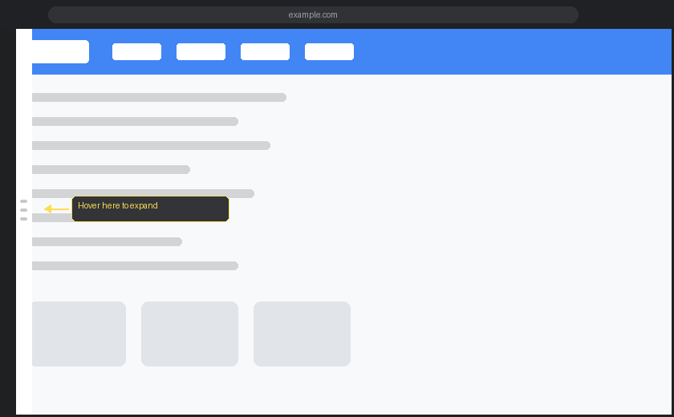
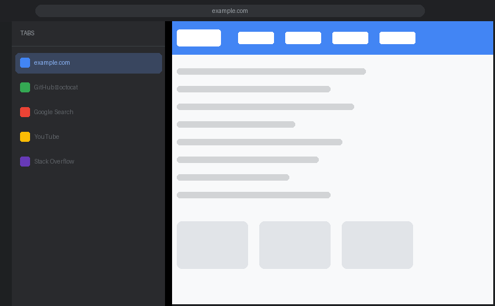

# Hover Vertical Tabs

Chrome の垂直タブパネルを **マウスオーバーだけで展開**できる Chrome 拡張機能です。  
Collapse 状態でも左端にマウスを近づけるだけでタブ一覧を確認・操作できます。

---

## スクリーンショット

### 通常時（Collapse 状態）
左端に半透明のハンドルが表示されます。ページの表示を極力妨げないよう、普段は限りなく透明に保たれています。



### ホバー時（パネル展開）
ハンドルにマウスを乗せると、タブ一覧パネルがスライドインします。



---

## 機能

| 操作 | 動作 |
|------|------|
| 左端にホバー | タブ一覧パネルが展開 |
| タブをクリック | そのタブへ切り替え |
| × をクリック | タブを閉じる |
| パネル外へマウスを移動 | パネルが自動で閉じる |

- ダーク / ライトテーマ自動対応
- ブラウザの表示言語に合わせた UI（日本語 / 英語）

---

## 動作環境

- Google Chrome 114 以降

---

## インストール

Chrome Web Store への公開前は、デベロッパーモードで直接読み込む方法でインストールできます。

1. このリポジトリをクローン（または ZIP でダウンロード・解凍）

   ```bash
   git clone https://github.com/<your-username>/hover-tab-panel.git
   ```

2. Chrome で `chrome://extensions/` を開く

3. 右上の **デベロッパーモード** をオンにする

4. **パッケージ化されていない拡張機能を読み込む** をクリックし、クローンしたフォルダを選択

---

## 使い方

1. Chrome の垂直タブを有効にし、パネルを Collapse する（省略可）
2. 任意のページを開く
3. ページ**左端**（画面の端ではなく、コンテンツ領域の左端）にマウスを乗せる
4. タブ一覧パネルが展開されるので、目的のタブをクリック
5. パネル外にマウスを移動すると自動で閉じる

> **Note**  
> 本拡張機能は Chrome のネイティブ垂直タブパネル自体を操作するのではなく、ページのコンテンツ領域にオーバーレイとして描画されます。Chrome の垂直タブと併用することも、本拡張機能単体で使うことも可能です。

---

## ファイル構成

```
hover-tab-panel/
├── manifest.json        # 拡張機能の設定（Manifest V3）
├── background.js        # タブの取得・切り替え・閉じる処理
├── content.js           # ホバーパネルの DOM 生成とイベント管理
├── content.css          # パネルのスタイル（ダーク・ライト対応）
├── icon16.png
├── icon48.png
├── icon128.png
└── _locales/
    ├── en/messages.json # English strings
    └── ja/messages.json # 日本語文字列
```

---

## ライセンス

[MIT](LICENSE)
